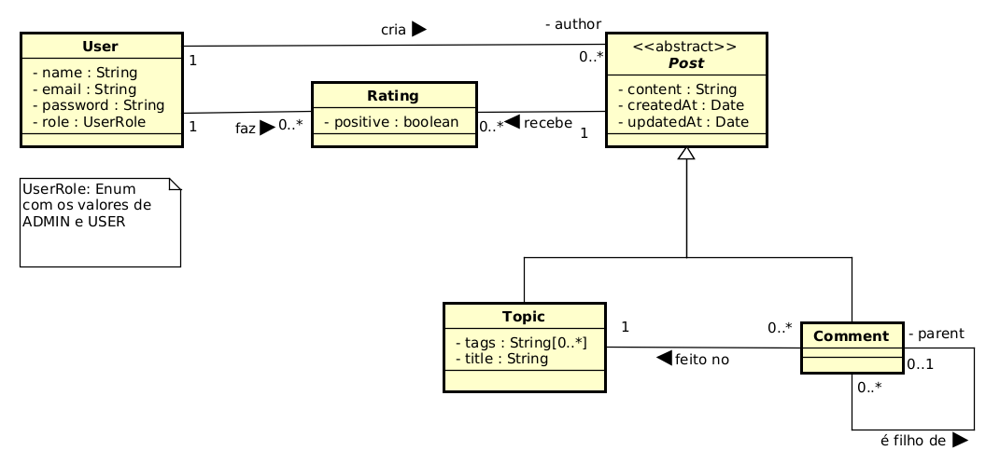

## Trabalho Projeto Integrado 2026/1

### Componentes

- Leticia Mariana da Silva Ferreira
- Paulo Sérgio Amorim Mônico
- Vitor Soprani Passamani

### 1. Introdução

O `ct_forum` visa desenvolver uma plataforma
para alunos do Centro Tecnológico da Universidade
Federal do Espírito Santo interagirem numa plataforma
centralizada.

A modelagem do domínio pode ser vista no seguinte diagrama de classes:



### 2. Tecnologias
- Spring Boot
- Postgres

### 3. Como executar o projeto

#### 3.1 Clone o repositório

```shell
git clone https://github.com/paulosergioamorim/ct_forum.git
cd ct_forum
```

#### 3.2 Crie um .env

Seu .env deve preencher estas variáveis:

```text
spring.datasource.url=
spring.datasource.username=
spring.datasource.password=
```

##### Explicação
- `spring.datasource.url`: URL para banco de dados Postgres. Seja
em Docker, hospedado na nuvem, ou na máquina local.
- `spring.datasource.username`: nome do usuário do banco de dados
- `spring.datasource.password`: senha para o usuário do banco de dados

#### 3.3 Compile e empacote o código fonte

```shell
mvn package
```

Esse comando criará um executável `.jar` na pasta `target`,
como `ct_forum-<version>.jar`. Atenção: sem um `.env` bem
definido, o código falhará em compilar.

#### 3.4 Executar o sistema

```shell
java -jar target/ct_forum-<version>.jar
```

Por padrão, a web api executa em `localhost:8080`

O `.env` deve estar localizado no mesmo diretório de onde se
executa o sistema (`pwd`).

### 4. Como gerar a documentação

#### 4.1 Documentação JavaDoc

Execute este comando:

```shell
mvn javadoc:javadoc
```

A raiz da documentação se encontra em `/target/reports/apidocs/index.html`

#### 4.2 Documentação Swagger UI

- Execute a aplicação
- Acesse o endpoint `/swagger-ui.html`
- Essa documentação tem como foco os controladores e a interface com os consumidores
da API

### 5. Docker (via Docker Compose)

Seção destinada a subir a infraestrutura com Docker Compose. Para utilizar o docker compose,
seu .env deve conter também estas variáveis de ambiente (além das definidas previamente):

```text
POSTGRES_PASSWORD=
POSTGRES_USER=
POSTGRES_DB=
PGADMIN_DEFAULT_EMAIL=
PGADMIN_DEFAULT_PASSWORD=
```

`POSTGRES_PASSWORD`, `POSTGRES_USER`, `POSTGRES_DB` devem estar em consonância com as variáveis
da aplicação Spring Boot definidas previamente. Certifique-se de ter o Docker e o Docker Compose
instalados. `PGADMIN_DEFAULT_EMAIL` e `PGADMIN_DEFAULT_PASSWORD` serão o login no container do
pgAdmin.

1. Primeiro, empacote o código-fonte (seção 3.1).
2. Em seguida, execute este comando para subir a infraestrutura:

```shell
docker compose up -d
```

Em uma API mais antiga:

```shell
docker-compose up -d
```

- `-d` indica que os containers serão executados em background.

Para verificar o status dos containers, execute este comando:

```shell
docker compose ps
```

Em uma API mais antiga:

```shell
docker-compose ps
```

